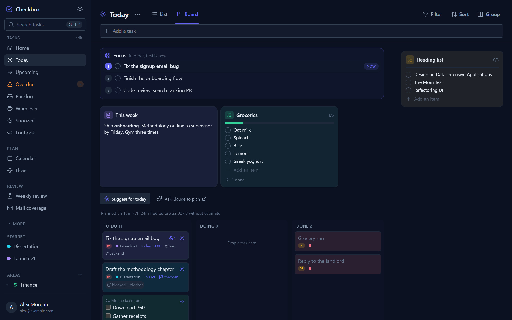

# Checkbox

Personal task manager with day planning, task dependencies, two-way Google Calendar sync and an MCP server for Claude. Installable PWA with offline support. Deployed on Cloudflare and in daily use.


Screenshots use a demo account with invented data.

## Overview

| | |
|---|---|
| Client | React 19, TypeScript, Tailwind v4, TanStack Query, dnd-kit |
| Server | Cloudflare Worker (Hono), D1 (SQLite), KV, R2 |
| Integrations | Google Calendar, Gmail, Web Push, email digest, MCP server (47 tools) |
| Codebase | ~36k lines of TypeScript, 40 migrations, 206 commits since June 2026 |
| Tests | 862 (Vitest), 98 files |

## Features

- **Two dates per task:** a deadline and a planned day. Today lists planned, due and overdue tasks, plus tasks with a subtask due today.
- **Focus:** an ordered shortlist for the current day. The first item is marked Now. The list clears overnight and unfinished items can be carried over.
- **Dependencies:** tasks can block other tasks. The Flow view lays out each project's chain. Completing the last blocker plans the waiting task for today.
- **Bulk editing:** Ctrl/Cmd-click and Shift-click selection on lists and boards. Bulk plan, deadline, snooze, priority, move and focus.
- **Natural-language input:** `call the plumber tomorrow 3pm p2 @phone #Home` sets date, time, priority, label and project. `every monday` sets a repeat rule.
- **Boards:** per-project boards with custom columns, and a board for Today.
- **Cards:** checklists and notes attached to Today, an area or a project. Managed on a board grouped by location.
- **Tracking:** home dashboard, weekly review with completion history, cadence trackers for recurring habits.
- **Task codes:** every task has a short code (`CB-142`) accepted by search, links and the MCP tools.
- **PWA:** installable, offline mutation queue, push notifications, light and dark themes.

## Screenshots

| | |
|---|---|
|  Flow view |  Bulk editing |
|  Project board |  Cards |
|  Task panel |  Today board |
|  Home |  Weekly review |
|  Light theme | <br>Mobile |

## Architecture

```
PWA (React)                                   Claude
   | /api                                       | /mcp (JSON-RPC)
   v                                            v
Cloudflare Worker (Hono): REST API, MCP server, cron jobs
   |
D1 (SQLite)   KV (sessions)   R2 (attachments)   Google APIs
```

- View queries (Today, Upcoming, Overdue, ...) are defined once in `src/worker/lib/viewSql.ts` and shared by the REST API and the MCP server. A parity test checks both return identical results.
- Date fields are validated in the API, enforced by database triggers, and handled defensively in the client.
- All day boundaries, reminders and scheduled jobs use the user's timezone, with tests across DST changes.
- Every row is scoped to a user; an isolation test suite covers reads, writes and guessed ids across accounts.
- Google OAuth sign-in with an invite list, OAuth state checks on every flow, signed calendar webhooks, a strict Content-Security-Policy, and sandboxed file downloads.
- Task codes come from a per-user counter maintained by a database trigger, so codes are never reused.
- A coverage test fails if an app feature or task field has no matching MCP tool.

## Running locally

Requires Node 22.5+.

```bash
npm install
cp .dev.vars.example .dev.vars   # enables the local sign-in bypass
npm run migrate:local
npm run dev:worker               # API on :8787
npm run dev                      # client on :5173
npm test
```

## Licence

Copyright (c) 2026 Tamara Sovcikova. All rights reserved. The source is published for review only; no licence is granted to copy, modify or distribute it.
