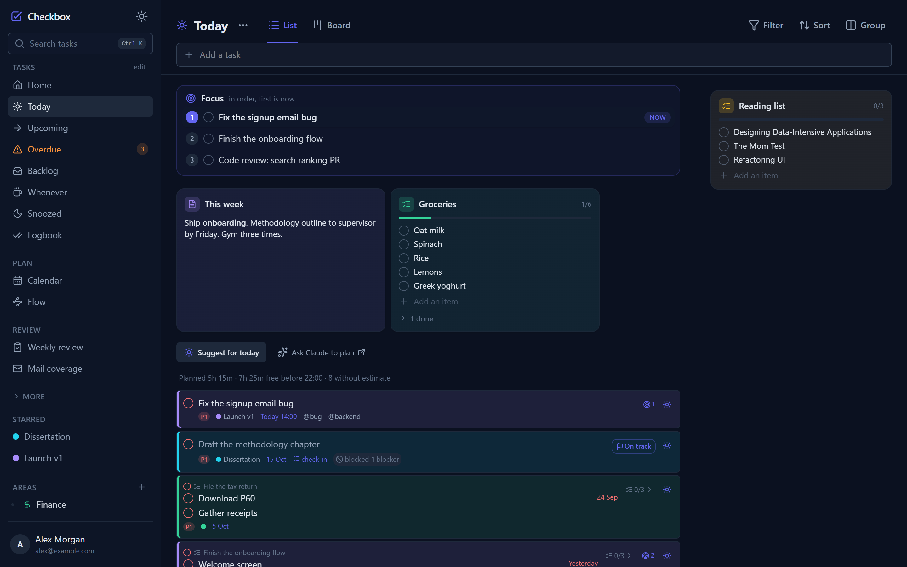
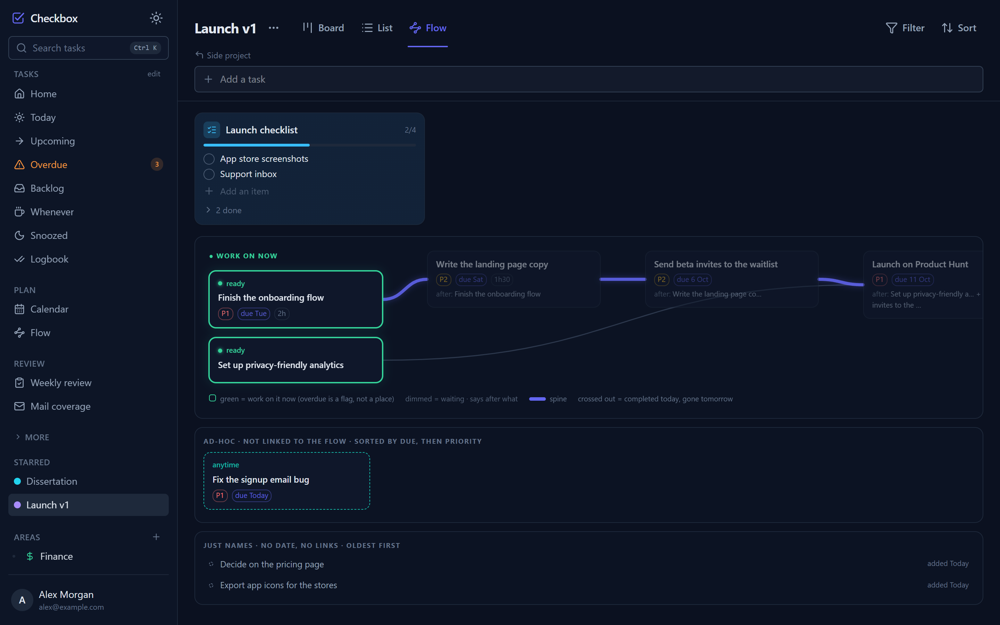
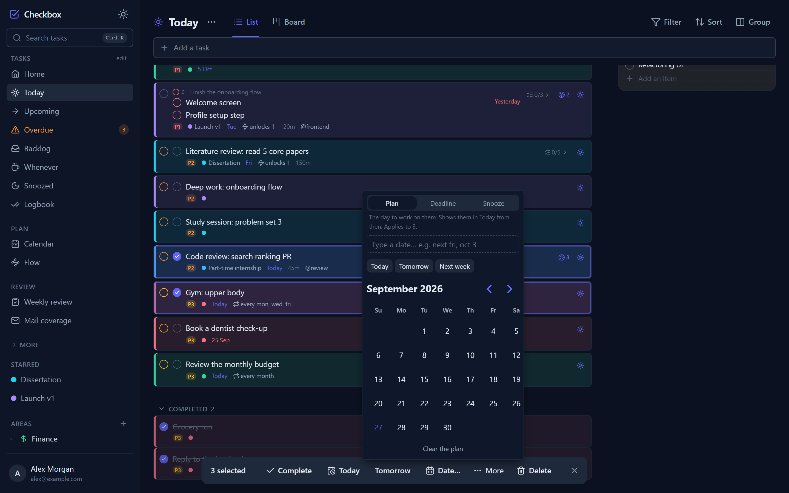
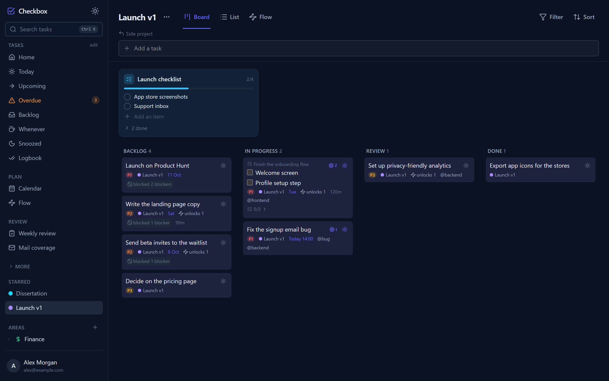
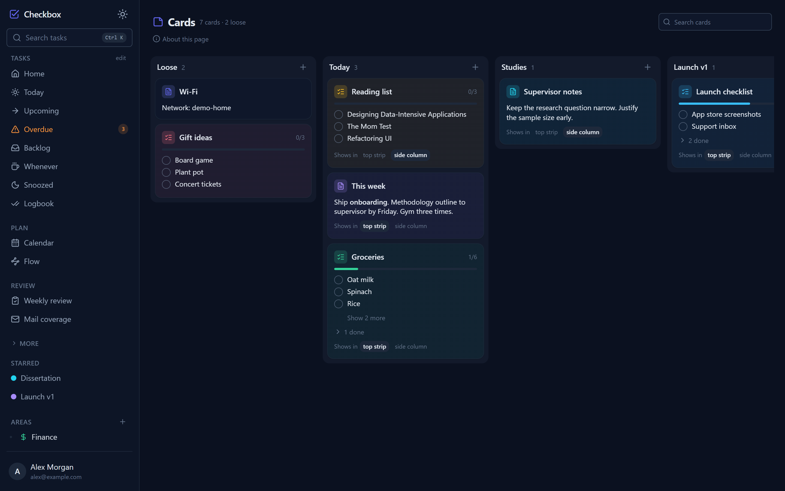
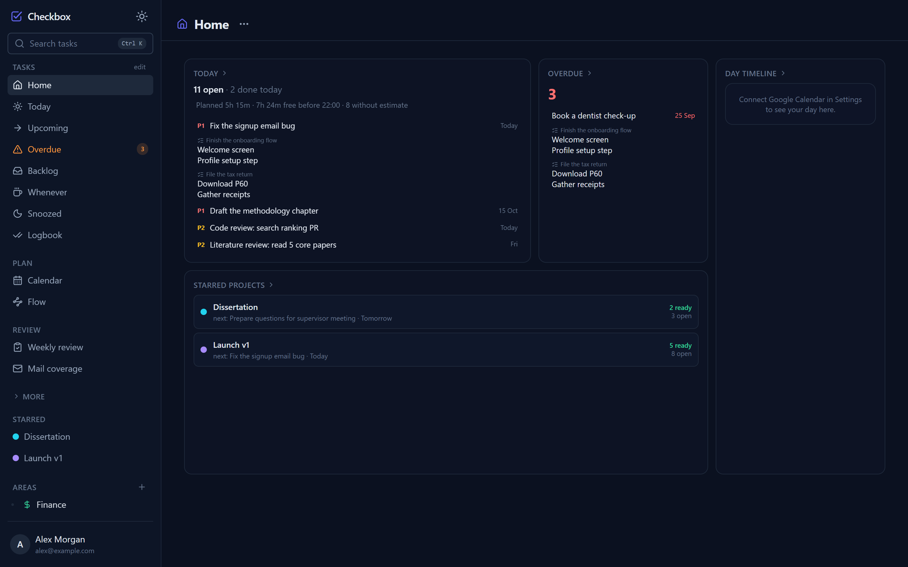
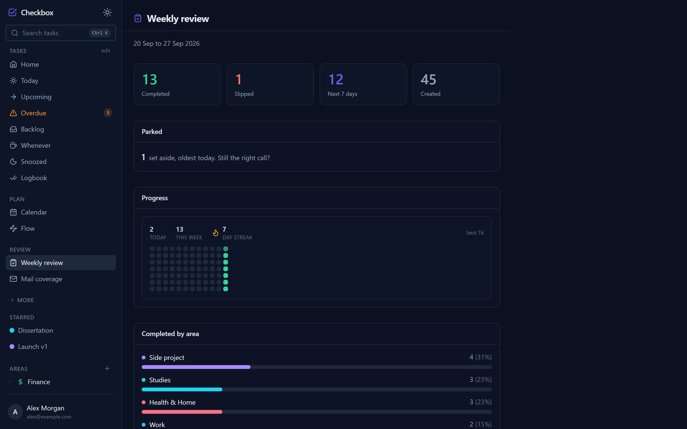
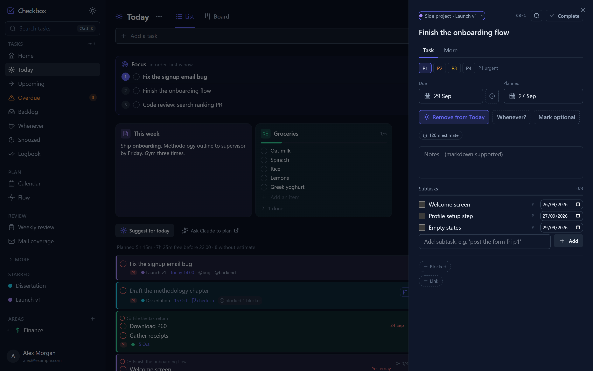
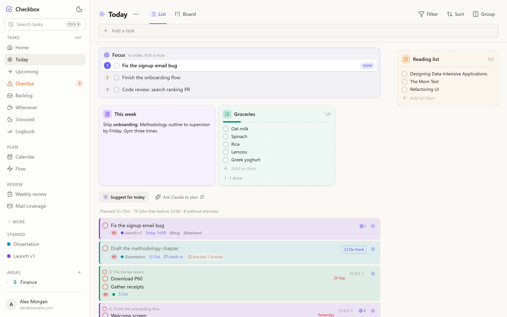
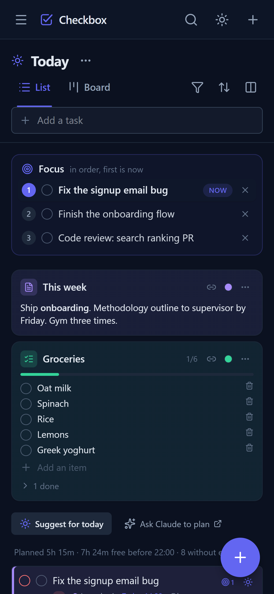

# Checkbox

A task manager I designed and built for myself, and use every day. It plans the day around deadlines, dependencies and a short ordered focus list, syncs both ways with Google Calendar, works offline as an installable app, and exposes everything to Claude through an MCP server, so an assistant can read and change my tasks the same way I do.



*All screenshots use an invented demo account.*

## At a glance

| | |
|---|---|
| **Stack** | React 19, TypeScript, Tailwind v4 on the client; a Cloudflare Worker (Hono) with D1 (SQLite), KV and R2 on the server |
| **Size** | about 36,000 lines of TypeScript, 40 database migrations, 206 commits since June 2026 |
| **Tests** | 862 tests across 98 files, including cross-user isolation, security regressions and app/assistant parity |
| **Integrations** | Google Calendar (two-way), Gmail, Web Push, email digest, an MCP server with 47 tools |
| **Runs on** | Cloudflare's free tier, deployed and in daily use |

## Features

**Today, planned from two dates.** Every task has a deadline (when it is owed) and a planned day (when I mean to work on it). Today shows what is planned for today or earlier, what is due or overdue, and any task whose individual step is due today, shown as that step with its parent above it.

**Focus.** A short, numbered list at the top of Today that says what order the day goes in. The first item is marked Now; finishing it moves the next one up. It belongs to the day and clears overnight, with a one-tap offer to carry over what was left.

**Dependencies and the Flow view.** Tasks can block each other. A project's Flow tab lays the chain out as a runway, with what can be worked on now on the left. Completing the last blocker plans the waiting task for today and says so.



**Multi-select and bulk edits.** Ctrl or Cmd-click to select, Shift-click for a range, the same on every list and board. The bulk bar can plan, set deadlines, snooze to any date (typed in plain words like "next fri"), change priority, move between projects, or add to Focus.



**Natural-language capture.** Typing "call the plumber tomorrow 3pm p2 @phone #Home" gives a task with a due date and time, priority, label, and the area or project called Home; "every monday" sets a repeat rule.

**Boards.** Each project has a board with its own columns; Today has one too (to do, doing, done).



**Cards.** Checklists and notes kept next to the tasks they relate to: pinned to Today, an area or a project, or kept loose. The Cards page is a board with one column per place; dragging a card moves it.



**Home, review and cadences.** A dashboard of today, overdue work and starred projects; a weekly review with completion history and streaks; and cadence trackers for things measured by how long it has been ("call grandma every two weeks") rather than by a date.

| Home | Weekly review |
|---|---|
|  |  |

**The task panel.** Everything about a task in one place: the two dates, steps with their own due dates, blockers, related tasks, estimates, recurrence, reminders and attachments. Every task has a short code (CB-142) that can be typed, searched or said out loud.



**Themes and mobile.** Light and dark modes with several colour palettes, and a layout that works as an installed app on a phone.

| Light theme | Phone |
|---|---|
|  |  |

## How it is built

```
Browser / installed PWA                      Claude (desktop, web, code)
React + TanStack Query                                  |
offline mutation queue, service worker                  | MCP (JSON-RPC over HTTP)
        |  /api                                          |  /mcp
        v                                                v
+----------------------------------------------------------------------+
|  Cloudflare Worker (Hono): REST API, MCP server, scheduled jobs       |
+----------------------------------------------------------------------+
      D1 (SQLite)      KV (sessions)      R2 (files)      Google APIs
```

A few decisions worth reading in the code:

- **One query per view, shared by the app and the assistant.** Today, Upcoming, Overdue and the rest are defined once (`src/worker/lib/viewSql.ts`) and used by both the REST API and the MCP server. A parity test builds data that exercises every rule and checks both return the same tasks, so the assistant can never see a different Today from the one on screen.
- **Dates guarded three times.** Writers normalise or reject bad values, database triggers abort a malformed write, and the client's date formatting cannot throw. Added after a bad value from an API client once blanked the app.
- **The user's own timezone everywhere.** The day boundary, reminders and the nightly jobs all use the stored timezone through one helper, with tests at daylight-saving boundaries.
- **Isolation by construction.** Every row is owned by a user and every query is scoped by it; a test suite checks one user cannot read, edit, complete or re-parent another's tasks, including by guessed ids.
- **Security.** Google OAuth sign-in with an invite list, one-time state on every OAuth flow, signed calendar webhooks, a strict Content-Security-Policy, and uploaded files served so they can never run as pages.
- **Task codes that never recycle.** A database trigger assigns each task's code from a per-user counter, so a deleted task's code is never handed to a new one.
- **The assistant cannot fall behind the app.** A test fails if a task field or a whole feature exists in the app without a matching MCP tool.

## Running it locally

Requires Node 22.5 or later.

```bash
npm install
cp .dev.vars.example .dev.vars      # local sign-in bypass, no Google account needed
npm run migrate:local
npm run dev:worker                  # API and database on :8787
npm run dev                         # the app on :5173
npm test
```

## Licence

Copyright (c) 2026 Tamara Sovcikova. All rights reserved.

The source is public so it can be read and reviewed. No licence is granted to copy, modify or redistribute it.
